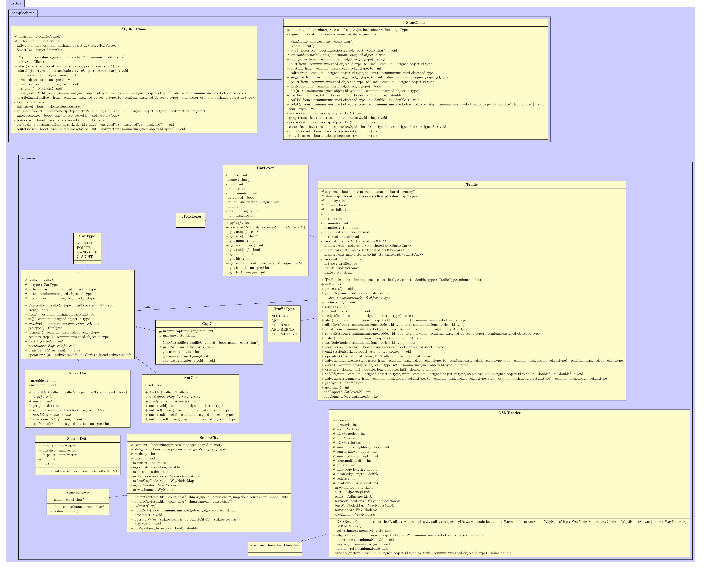

# TeX-UML

This is the UML Diagram of the [Robocar World Championship](https://github.com/nbatfai/robocar-emulator) made in LaTex using the TikZ library.
## Creating PDF from this project
In the terminal open this folder, then type make.

## Creating png from the PDF
```bash
pdftoppm OOCWC.pdf OOCWC -png
```

